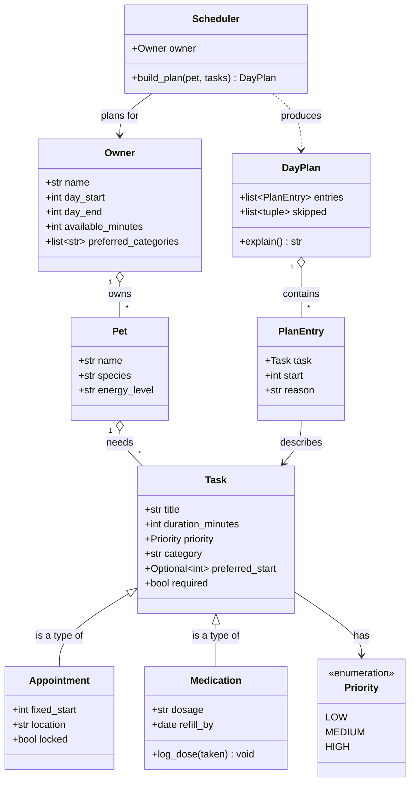

# PawPal+ Product & Design Overview

*A plain-language guide for everyone: pet owners, business stakeholders, and the build team.*

---

## 1. The Problem We're Solving

Busy pet owners struggle to stay consistent with care. They forget medications, food, appointments, who were their pet caregivers.

**PawPal+ is a smart daily planner for pet care.** You tell it about your pet, your tasks, and how much time you have. It builds a realistic schedule for the day, protects the things that can't be missed, and explains its choices in plain
language so you can trust the plan.

---

## 2. What PawPal+ Does (The Value)

| Promise | What it means for the owner |
|---|---|
|  **Never miss critical care** | Medications and vet appointments are locked in first. They're never dropped, even on a busy day. |
|  **A realistic day, not a wishlist** | The plan fits the time you actually have, so you're set up to succeed instead of overwhelmed. |
|  **Explains every choice** | Each task shows *why* it's there and *when* it happens
|  **Heads-up before stock out** | Warns when food, litter, or meds are running low. No more emergency store runs. |

---

## 3. How It Works 

Four simple steps, start to finish:

```
   STEP 1                STEP 2               STEP 3              STEP 4
 ┌─────────┐          ┌──────────┐         ┌──────────┐       ┌──────────┐
 │  SET UP │   ──▶    │   ADD    │   ──▶   │ GENERATE │  ──▶  │  REVIEW  │
 │         │          │  TASKS   │         │   PLAN   │       │ THE PLAN │
 └─────────┘          └──────────┘         └──────────┘       └──────────┘
 Tell us about        List care tasks      We build the        See your day,
 you & your pet,      (walks, feeding,     schedule that       with the reason
 and how much         meds, vet visits)    fits your day       behind each task
 time you have                                                 + what didn't fit
```

**Step 1: Set up.** Enter your name, your pet's details, and your constraints: how much time you have today and your earliest/latest hours.

**Step 2: Add tasks.** List what your pet needs: a walk, feeding, medication, a grooming appointment. Each task has a length, an importance level, and (optionally) a preferred time.

**Step 3: Generate the plan.** PawPal+ does the thinking:
- Locks in **fixed appointments** first (they can't move).
- Guarantees **must-do tasks** like medication.
- Fits the rest by **importance**, then preferred time, then what packs in best.
- Sets aside anything that genuinely won't fit,and tells you why.

**Step 4: Review.** You get a clear timeline (e.g. *08:00–08:20 Morning walk*), a short reason for each item, and an honest list of anything skipped.

---

## 4. The Building Blocks (Behind the Scenes)

This is the technical blueprint for the build team. **Non-technical readers can skip it**,think of it simply as the list of "things" the app keeps track of
and how they connect: an *Owner* has *Pets*, each pet has *Tasks*, and the
*Planner* turns those tasks into a *Daily Plan*.



**In plain words:**

| Building block | Plain-language meaning |
|---|---|
| **Owner** | You, your details and how much time you have. |
| **Pet** | Your animal and its basic info. |
| **Task** | One thing to do (a walk, a feeding), how long, how important. |
| **Appointment** | A task with a *fixed* time, like a vet visit, that can't be moved. |
| **Medication** | A must-do task with a dose, tracked so it's never missed. |
| **Scheduler** | The "brain" that turns your tasks into a plan. |
| **Day Plan** | The finished schedule, with a reason for every item. |

---

## 5. What's Included

| PawPal+ |
|---|
| Owner & multiple-pet setup |
| Tasks, appointments, and medications |
| Recurring tasks (daily / weekly / monthly reminders) |
| Smart daily schedule with a reason for every item |
| Honest "didn't fit" list |
| Supply tracking & reorder alerts |
| Shared caregivers (family, dog walker) |
| Health log |

---

